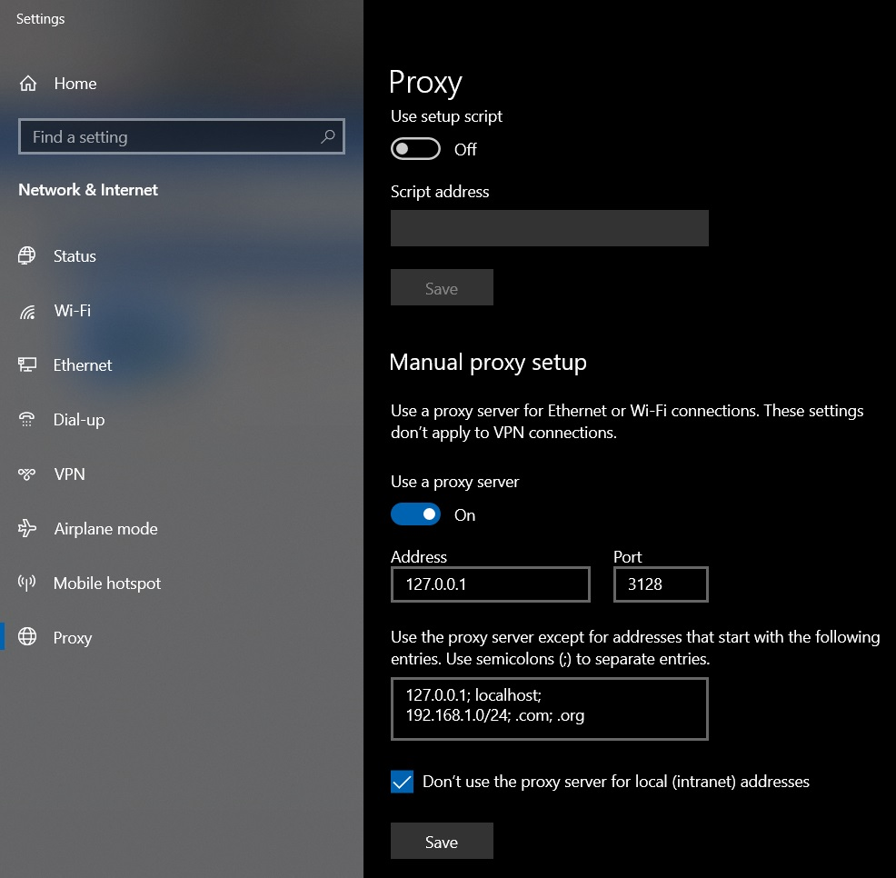

# Docker HTTP to SOCKS5 PROXY

Adjust the tsocks.conf replacing the variables by your user name and password, 
and other configurations related to your SOCKS5 paths: 

```
default_user = user
default_pass = password
```

and check if the tsocks.conf is the correct path inside docker-compose.yml and run by using : 

```bash
docker run -v path/tsocks.conf:/etc/tsocks.conf -p 3128:3128 docker-htsp:latest 
```

Example: 

```bash
export http_proxy="http://127.0.0.1:3128"
export https_proxy="http://127.0.0.1:3128"
```
curl http://host.target.domain


Or configure the Windows Proxy :


